class:  center middle
background-image: url("fig/Couv.png")
background-size: cover


# Les images raster 


<!-- D'office sous xaringanthemer -->
```{r setup, include=FALSE}
options(htmltools.dir.version = FALSE)
knitr::opts_chunk$set(
  fig.width=9, fig.height=3.5, fig.retina=3,
  out.width = "100%",
  cache = FALSE,
  echo = TRUE, 
  message = FALSE, 
  warning = FALSE,
  hiline = TRUE
)
```

```{r xaringan-themer, include=FALSE, warning=FALSE}
library(xaringanthemer)
style_duo_accent(
  primary_color = "#1381B0",
  secondary_color = "#FF961C",
  inverse_header_color = "#FFFFFF"
)
```

<!-- Lancement des librairies -->
```{r Libraries, warning=FALSE, include=FALSE}
library(rgdal)
library(raster)
library(terra)
library(stars)
library(leaflet)
library(sf)
library(rasterVis)
library(ggplot2)
library(dplyr)
```

---

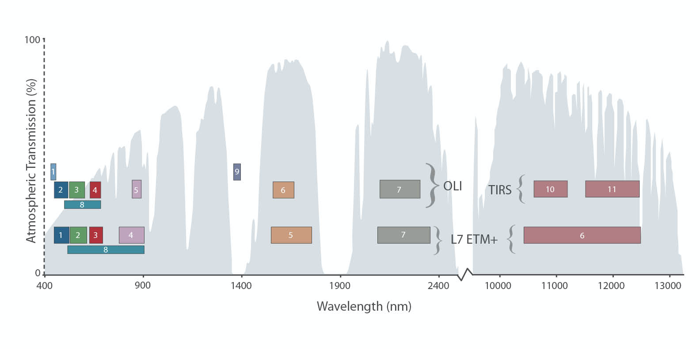
[Landsat NASA](https://landsat.gsfc.nasa.gov/sites/landsat/)


---

.pull-left[
```{r echo=FALSE, fig.height=5.5, message=FALSE, warning=FALSE}
# Ex 1 : BD Alti de l'IGN 25m
# lecture du fichier Geotiff + CRS
r <- rast("data/BDAlti_IGN_25m/BDALTIV2_25M_FXX_0350_6550_MNT_LAMB93_IGN69.asc" )
crs(r) <- "epsg:2154" 
# zoom sur une petite zone 
r_zoom_alti <- crop(r, c(370200,370400,6535700, 6535830))
plot(r_zoom_alti, main="Extrait de la BD Alti IGN 25m", axes=F)
text(r_zoom_alti, digits=1)
```
]

.pull-right[
```{r echo=FALSE,fig.height=6, message=FALSE, warning=FALSE}
# Ex 2 : Corine Land Cover 2018
r <- rast("data/CLC2018_v2020_100m/U2018_CLC2018_V2020_20u1.tif" )
r_zoom <- crop(r, c(3450900, 3452700, 2588000, 2589200))
# création de la palette de couleurs pour chaque poste CLC
CLC2018_legend <- read.csv("data/CLC2018_v2020_100m/Legend/CLC2018_CLC2018_V2018_20_QGIS.txt", header=FALSE)  # fichier légende de CLC
CLC2018_legend <- CLC2018_legend[sort(unique(r_zoom[])) ,]
coul <- rgb(CLC2018_legend[,2],CLC2018_legend[,3], CLC2018_legend[,4], maxColorValue = 255)
# carto rapide
plot(r_zoom,  col=coul, main="Extrait de Corine Land Cover (2018)", type="classes", plg=list(legend=CLC2018_legend$V6), axes = F)
text(r_zoom, cex=1)
```
]

--
class:center

**qq mots sur le poids des images...**

--
<center>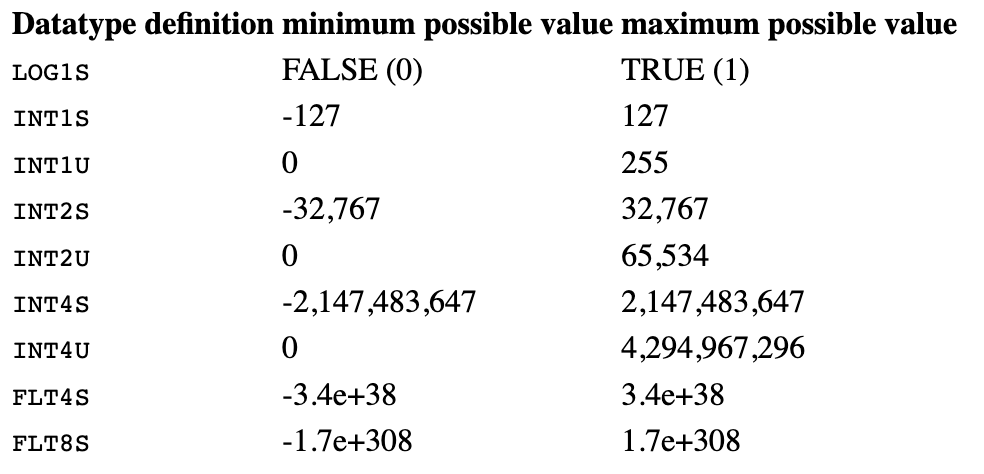</center>
[dataType {raster}](https://search.r-project.org/CRAN/refmans/raster/html/dataType.html)

---
## Intérêts/avantages
.pull-left[
- structure des données ~ simple, <br>topologie implicite
]

---
## Intérêts/avantages
.pull-left[
- structure des données ~ simple, <br>topologie implicite
- information spatiale **continue**, <br>
souvent récoltée **à distance** et **globalement**
]
<center>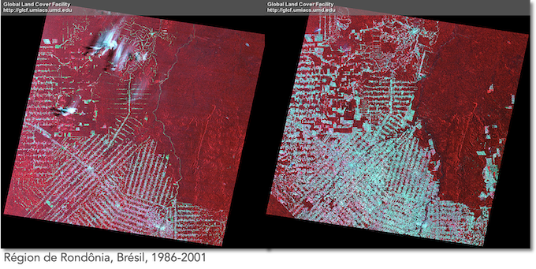</center>


---
## Intérêts/avantages
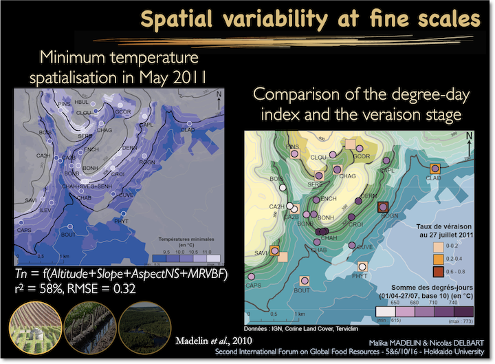

---
## Intérêts/avantages

.pull-left[
- structure des données ~ simple, <br>topologie implicite
- information spatiale **continue**, <br>
souvent récoltée **à distance** et **globalement**
- information figée dans le **temps** <br>+ répétitivité
]

---
## Intérêts/avantages

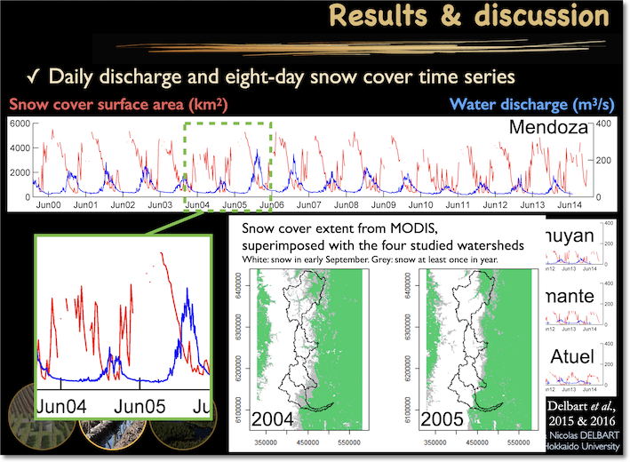

---
## Intérêts/avantages

.pull-left[
- structure des données ~ simple, <br>topologie implicite
- information spatiale **continue**, <br>
souvent récoltée **à distance** et **globalement**
- information figée dans le **temps** <br>+ répétitivité
- caractère **multispectral** (bandes/couches),
- parfois **multidimensionnel** (hauteur, profondeur / temps)
]
.pull-right[
<center>Composition colorée, Sentinel 2A, 28/5/21</center>
```{r echo=FALSE, fig.height=7}
sen <- rast("data/Sentinel/T30TXR_20210528T105621_TCI_60m.jp2")
plotRGB(sen, r=1,g=2,b=3) 
```
]

---
## Intérêts/avantages

.pull-left[
- structure des données ~ simple, <br>topologie implicite
- information spatiale **continue**, <br>
souvent récoltée **à distance** et **globalement**
- information figée dans le **temps** <br>+ répétitivité
- caractère **multispectral** (bandes/couches),
- parfois **multidimensionnel** (hauteur, profondeur / temps)
- plusieurs thématiques possibles pour une même image
- relative facilité des traitements
]
.pull-right[
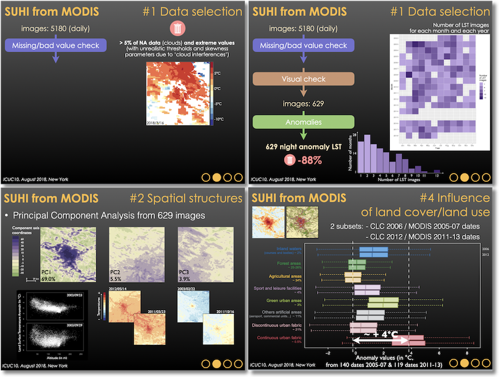
Extrait d'une présentation de Madelin et Dupuis, 2018 
]

---
## Intérêts/avantages

.pull-left[
- structure des données ~ simple, <br>topologie implicite
- information spatiale **continue**, <br>
souvent récoltée **à distance** et **globalement**
- information figée dans le **temps** <br>+ répétitivité
- caractère **multispectral** (bandes/couches),
- parfois **multidimensionnel** (hauteur, profondeur / temps)
- plusieurs thématiques possibles pour une même image
- relative facilité des traitements

]
.pull-right[

Extrait d'une présentation de Madelin et Dupuis, 2018 
]


... mais **volume** des données non négligeable 

---

## Par rapport à la reproductibilité

- souvent homogénéité dans la production des données (produits globaux), harmonisation "minime"


--
<center>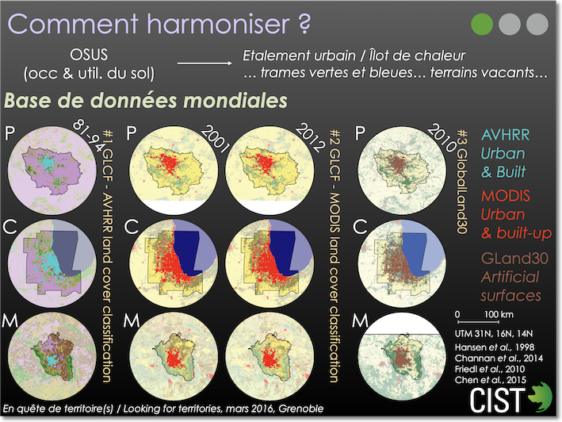</center>
<center>Extrait d'une présentation de Pécout <it>et al</it>, 2016</center>
<center>Projet Grandes métropoles</center>
---

## Par rapport à la reproductibilité

- souvent homogénéité dans la production des données (produits globaux), harmonisation "minime"

- données souvent accessibles <br>
_via_ des **plateformes** ([Earth Explorer](), [Sentinel Hub](), [GEE](), ...) <br>

<center></center>

---

## Par rapport à la reproductibilité

- souvent homogénéité dans la production des données (produits globaux), harmonisation "minime"

- données souvent accessibles <br>
_via_ des **plateformes** ([Earth Explorer](), [Sentinel Hub](), [GEE](), ...) <br>
_via_ des **outils d'extraction** pour certaints formats (ncdf) <br>
_via_ certains packages R (`{raster}`, `{modisTSP}`, `{sen2r}`...)

--
- de nombreux formats ouverts<br>
[geotiff](https://www.ogc.org/standards/geotiff) / [jp2](https://fr.wikipedia.org/wiki/JP2) / asc / [gpkg-raster](https://gdal.org/drivers/raster/gpkg.html) / [coverageJSON](https://covjson.org/...)<br>
([ncdf](https://www.unidata.ucar.edu/software/netcdf/) / hdf /grib...) 

---

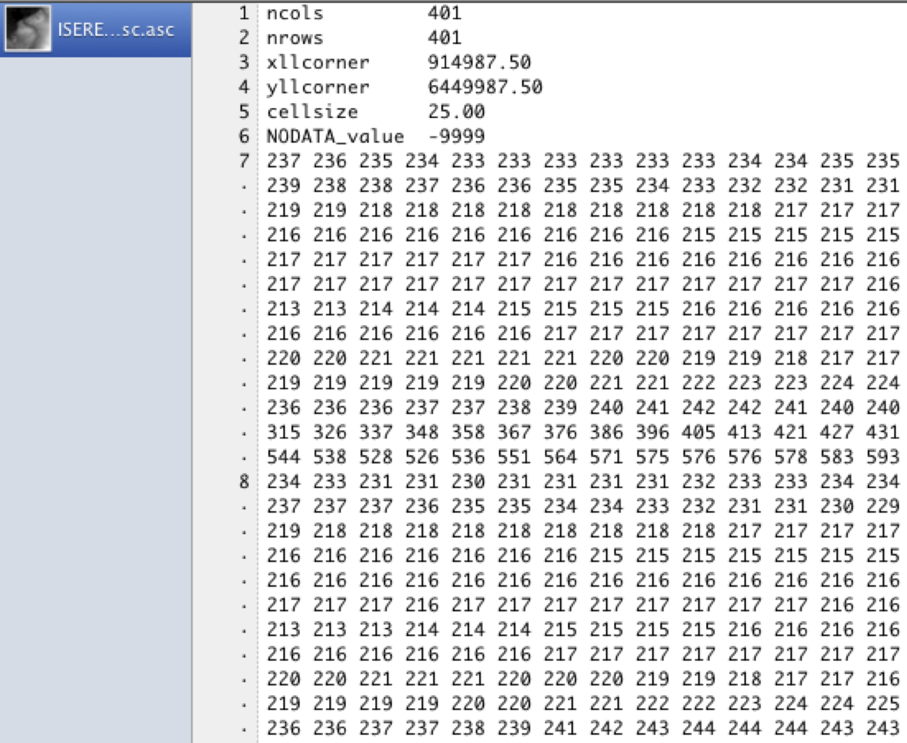
(BD Alti 25m)

---

## Par rapport à la reproductibilité

- souvent homogénéité dans la production des données (produits globaux), harmonisation "minime"

- données souvent accessibles <br>
_via_ des **plateformes** ([Earth Explorer](), [Sentinel Hub](), [GEE](), ...) <br>
_via_ des **outils d'extraction** pour certaints formats (ncdf) <br>
_via_ certains packages R (`{raster}`, `{modisTSP}`, `{sen2r}`...)

- de nombreux formats ouverts<br>
[geotiff](https://www.ogc.org/standards/geotiff) / [jp2](https://fr.wikipedia.org/wiki/JP2) / asc / [gpkg-raster](https://gdal.org/drivers/raster/gpkg.html) / [coverageJSON](https://covjson.org/...)<br>
([ncdf](https://www.unidata.ucar.edu/software/netcdf/) / hdf /grib...) 

--
<center>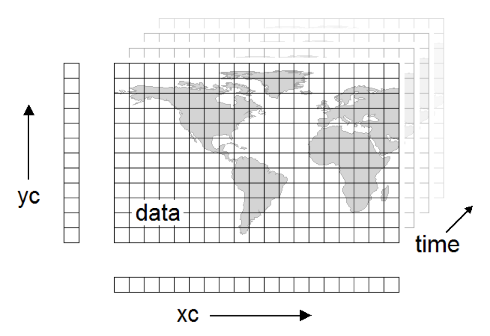</center>
[UCAR](http://www.narccap.ucar.edu)

---
## Par rapport à la reproductibilité

.pull-left[
<center>Modèle numérique d'élévation <br>SRTM - Argentine</center>
```{r echo=FALSE, fig.height=6}
srtm <- raster("data/SRTM/srtm_23_19.tif")
# initialement obtenu avec :
# srtm <- getData('SRTM', lon=-69, lat=-33) 

# carto rapide du SRTM
raster::spplot(srtm, 
    col.regions = terrain.colors(100), 
    margin=FALSE
    )
```

]


.pull-right[

```{r}
dim(srtm)
```
Export `writeRaster()` selon 3 formats 
et calcul de la taille des fichiers résultants `file.size()`


```{r echo=FALSE}
# Export du RasterLayer dans 3 formats
writeRaster(srtm, filename="data/SRTM/srtm.asc", datatype="INT2S", overwrite=TRUE)
writeRaster(srtm, filename="data/SRTM/srtm.tif", datatype="INT2S", filetype="GTiff", overwrite=TRUE)
writeRaster(srtm, filename="data/SRTM/srtm.gpkg", datatype="INT2S", filetype="GPKG", overwrite=TRUE)

knitr::kable(tab <- cbind.data.frame("Type du fichier" = 
                                       c("ascii", "tif", "gpkg"),
    "Taille en Mo" = c(round(file.size("data/SRTM/srtm.asc") * 10^-6, 1),
     round(file.size("data/SRTM/srtm.tif") * 10^-6, 1),
     round(file.size("data/SRTM/srtm.gpkg") * 10^-6, 1)
                                           )
                        ), 
    format="html")

```
]

---
## Par rapport à la reproductibilité

- souvent homogénéité dans la production des données (produits globaux), harmonisation "minime"

- données souvent accessibles <br>
_via_ des **plateformes** ([Earth Explorer](), [Sentinel Hub](), [GEE](), ...) <br>
_via_ des **outils d'extraction** pour certaints formats (ncdf) <br>
_via_ certains packages R (`{raster}`, `{modisTSP}`, `{sen2r}`...)

- de nombreux formats ouverts<br>
[geotiff](https://www.ogc.org/standards/geotiff) / [jp2](https://fr.wikipedia.org/wiki/JP2) / asc / [gpkg-raster](https://gdal.org/drivers/raster/gpkg.html) / [coverageJSON](https://covjson.org/...)<br>
([ncdf](https://www.unidata.ucar.edu/software/netcdf/) / hdf /grib...) 

- des libraires C, communes à plusieurs logiciels/langages (GDAL, ...)


---

## Sous R, 3 packages "phares"

.left-column[
[`{raster}`](https://cran.r-project.org/web/packages/raster/) <br>


]

.right-column[
  .pull-left[
  <center>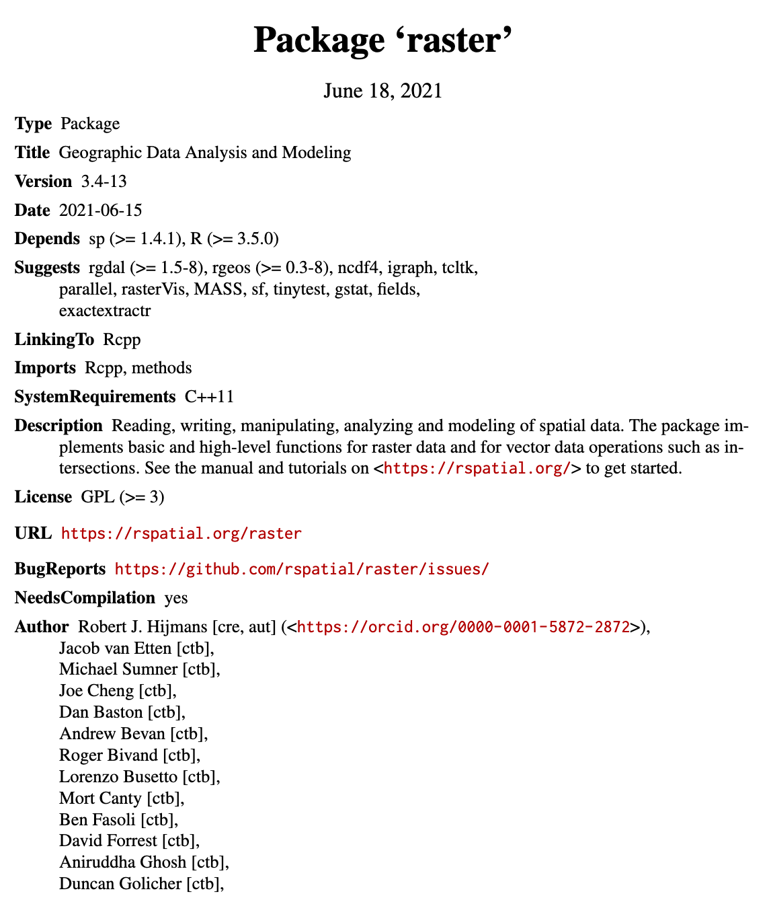</center>
  ]
  .pull-right[
  Documentation de 249p. (18/6/2018), 
  avec en préambule, une organisation par blocs : <br><br>
    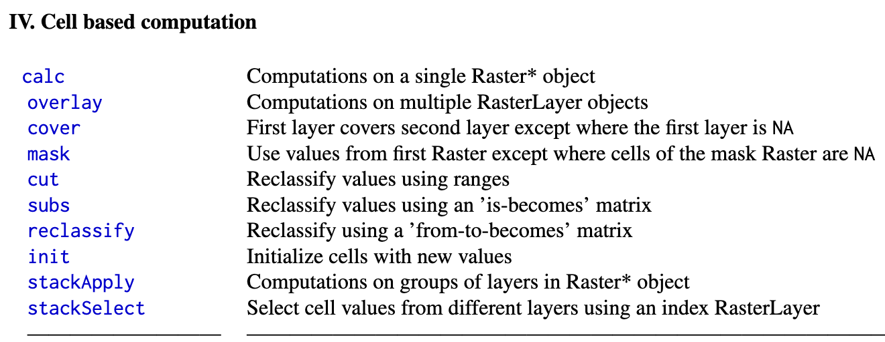 
  ]

  ]


---

## Sous R, 3 packages "phares"

.left-column[
[`{stars}`](https://cran.r-project.org/web/packages/stars/index.html) <br>


  
]
.right-column[

  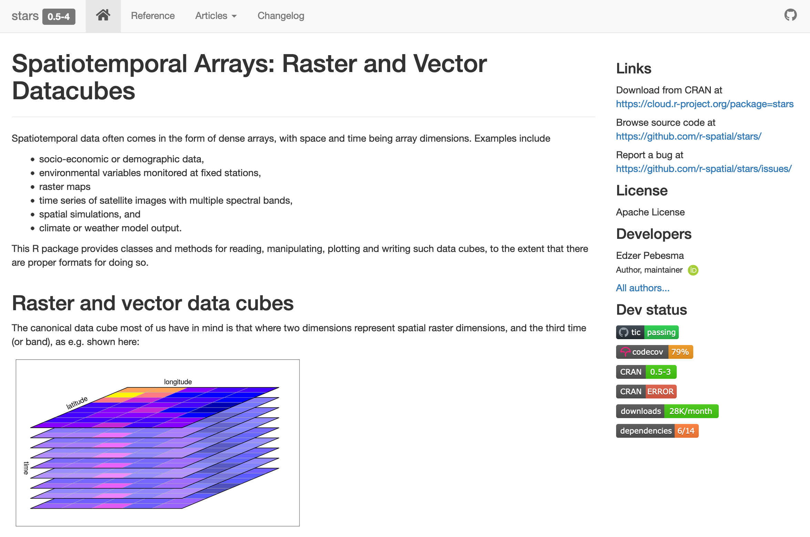
  ]
  

---

## Sous R, 3 packages "phares"

.left-column[
[`{terra}`](https://cran.r-project.org/web/packages/terra/) <br>


]
.right-column[
  .pull-left[
  <center>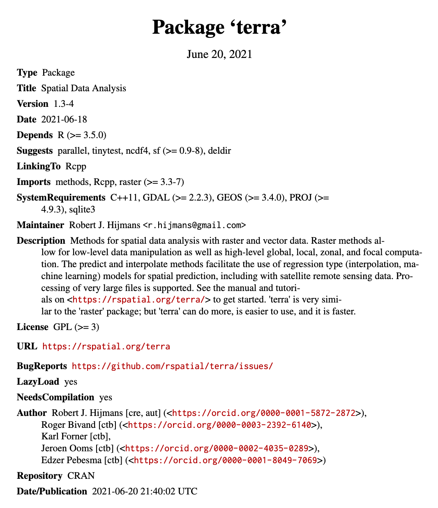</center>
  ]
  .pull-right[
    Documentation de 218p. (20/6/2018), 
    avec en préambule, une organisation par blocs : <br><br>
    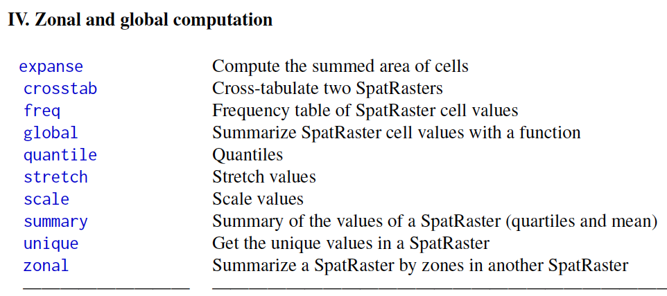
  ]

  ]

---
## Sous R, 3 packages "phares"

La "popularité" des 3 packages, à partir du nombre de téléchargements
```{r include=FALSE}
library(dlstats)
x <- cran_stats(c("raster", 
                  "terra",
                  "stars"))
```

```{r echo=FALSE}
ggplot(x, aes(end, downloads, 
              group=package, 
              color=package)) +
     geom_line() + 
  geom_point(aes(shape=package))
```


---
## Sous R, 3 packages "phares"

Comparatif du [blog de seascape](https://www.seascapemodels.org/rstats/2021/06/01/STARS.html) : "So terra was about 8.5 times faster than raster and stars was about 3 times faster than terra (so about 26 times faster than raster)."

Pour les opérations réalisées...

--

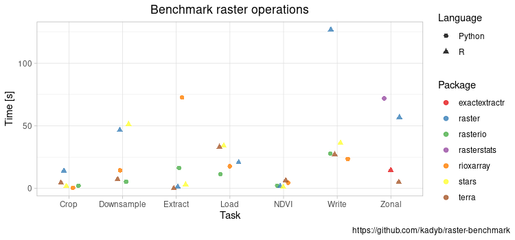
[Krzysztof Dyba - kadyb](https://github.com/kadyb/raster-benchmark)

---
class: inverse center middle

# Les traitements <br>sur les images raster


---

# Lecture des fichiers raster sous R

.left-column[
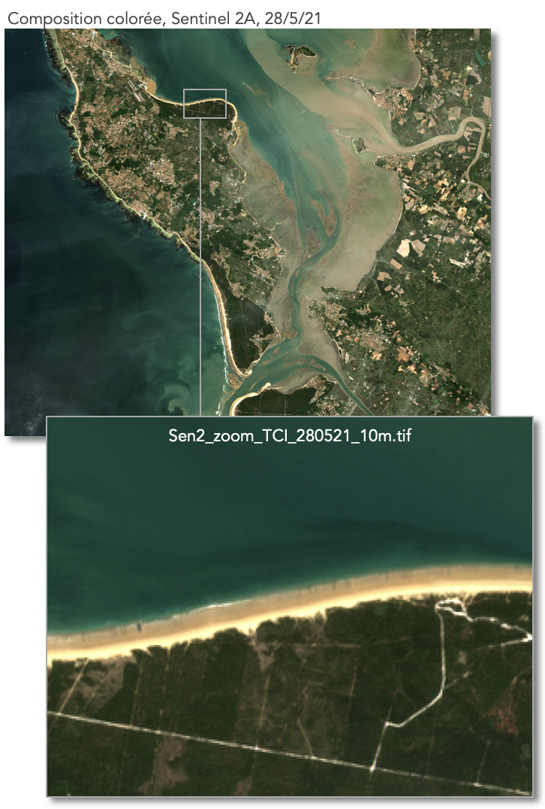
]
.right-column[
```{r}
file.size("data/Sentinel/Sen2_zoom_TCI_280521_10m.tif") * 10^-3 #  (en Ko)
GDALinfo("data/Sentinel/Sen2_zoom_TCI_280521_10m.tif")
```
]
---

# Lecture des fichiers raster sous R

Avec [`{raster}`](https://cran.r-project.org/web/packages/raster/) 

```{r}
r <- raster("data/Sentinel/Sen2_zoom_TCI_280521_10m.tif")
r
object.size(r) ; inMemory(r)
```

---

# Lecture des fichiers raster sous R

Avec [`{raster}`](https://cran.r-project.org/web/packages/raster/) 

```{r fig.width=10}
r_brick <- brick("data/Sentinel/Sen2_zoom_TCI_280521_10m.tif")
r_brick
object.size(r_brick)
```

---

# Lecture des fichiers raster sous R

Avec [`{terra}`](https://cran.r-project.org/web/packages/terra/) 

```{r}
t <- rast("data/Sentinel/Sen2_zoom_TCI_280521_10m.tif")
t
object.size(t)
```

---

# Lecture des fichiers raster sous R

Avec [`{stars}`](https://cran.r-project.org/web/packages/stars/index.html) 

```{r}
s <- read_stars("data/Sentinel/Sen2_zoom_TCI_280521_10m.tif")
s
object.size(s)
```

---
# Lecture des fichiers raster sous R

** Opérations classiques après lecture / création d'un raster : **

.left-column[
- dimensions
- étendue
- résolution(s)
- projection
]

---
# Lecture des fichiers raster sous R

** Opérations classiques après lecture / création d'un raster :**

.left-column[
- dimensions
- étendue
- résolution(s)
- projection
- visualisation (rapide)
- histogramme des valeurs
- parfois améliorations des contrastes <br> ( _stretching_ )
]

.right-column[
.pull-left[

]

.pull-right[

```{r echo=FALSE, fig.height=8, message=FALSE, warning=FALSE}
r <- raster("data/Sentinel/Sen2_zoom_B08_10m.tif")
hist(values(r), 100)
```
À partir de Sentinel B08
]

]

---
# Modifications de la zone d'étude

--
### • (re)projection


Source : Centre Canadien de Télédétection

---
# Modifications de la zone d'étude

### • (re)projection
`raster:projectRaster()` / `terra:project()` / `stars:st_transform()`

--
<center>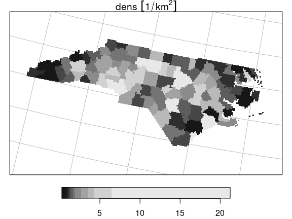</center>
[avec `{stars}`](https://cran.r-project.org/web/packages/stars/vignettes/stars5.html)
---
# Modifications de la zone d'étude

### • découpage et masque ( _crop & mask_ )


```{r}
# on reprend la compo colorée de Sentinel 2 (sen)
# ajout du buffer 30 km autour d'ici (cf. présentation de Ronan)
buf <- st_read(dsn = paste0("data/KeynoteRonan/oleron.gpkg"), 
               layer = "cnrsBuf", quiet = TRUE)
buf <- st_transform(buf, crs(sen))  # pour avoir le même CRS
buf <- vect(buf) # transformation de l'objet sf en object SpatVector (terra)

# découpage (selon l'étendue)
sen_Oleron_crop <- crop(sen, buf)

# masque
sen_Oleron_mask <- mask(sen, buf)
```

---
# Modifications de la zone d'étude

### • découpage et masque ( _crop & mask_ )

.left-column[
```{r echo=FALSE, fig.height=8, fig.width=8}
plot(sen)
plot(buf, add=TRUE)
```
]

---
# Modifications de la zone d'étude

### • découpage et masque ( _crop & mask_ )

.left-column[
```{r echo=FALSE, fig.height=8, fig.width=8}
plot(sen)
plot(buf, add=TRUE)
```
]


.right-column[

.pull-left[
<center> _CROP_ <center> 
```{r echo=FALSE, fig.height=5}
plot(sen_Oleron_crop, axes=TRUE )
```
]

.pull-right[
<center> _MASK_ </center> 
```{r echo=FALSE, fig.height=5}
plot(sen_Oleron_mask, axes=TRUE)
```
]

]


---
# Modifications de la zone d'étude

### • agrégation / désagrégation 

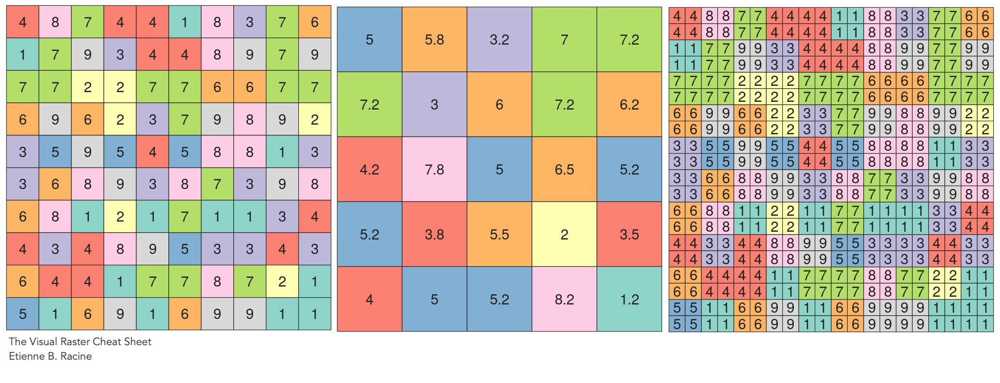

---
# Modifications de la zone d'étude

### • Fusion _merge_ et mosaïque

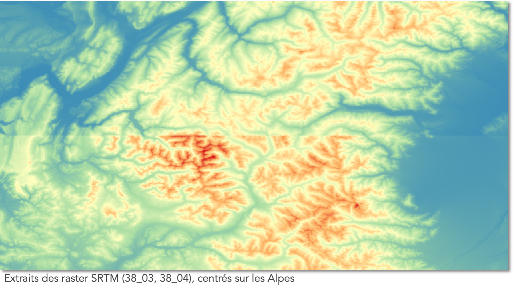


---
# Opérations locales

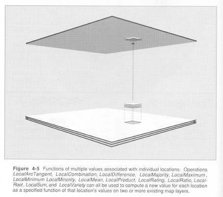

Source : J. Mennis
<!-- Figure d'un ancien cours de J. Mennis, qui reprend a priori une figure d'un ouvrage, mais pas d'info sur lequel -->


---
# Opérations locales

## • Reclassification ( _reclassify_ )

Des 44 postes les plus fins de la nomenclature CLC2018 aux 5 principaux 
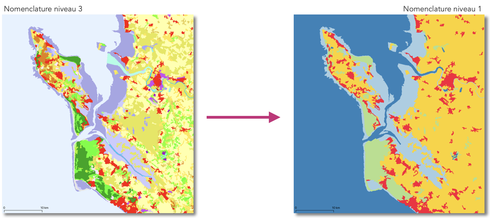

---
# Opérations locales

## • Création de "masque raster" (1/0)

De la lecture des valeurs spectrales à une typologie eau / pas eau
```{r echo=FALSE, fig.height=3}
r <- raster("data/Sentinel/Sen2_zoom_B08_10m.tif")
par(mfrow=c(1,3)) # paramètres graphiques
# Fig1 la bande B08 en gris
plot(r, col=colorRampPalette(c("black", "white"))(255))
# Fig2 l'histogramme des valeurs
hist(values(r), 100)
abline(v=500, col="red")
# Fig3 le résulta d'une classification en 2 classes 0/1
new_r <- reclassify(r, 
                    c(-Inf, 500, 1,
                      500, Inf, 0))
plot(new_r, col=colorRampPalette(c("grey", "blue"))(2))
```

Autre possibilité : `r[r>500] <- NA`

---
# Opérations locales

## • Calcul matriciel / Calculatrice raster

La gestion des valeurs manquantes : 

`r[r[]== -9999] <- NA` 

`r[is.na(r)] <- 0` 

---
# Opérations locales

## • Calcul matriciel / Calculatrice raster

<center> 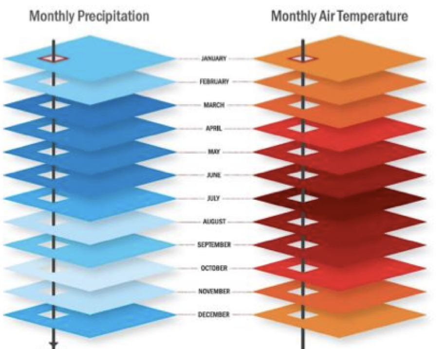</center>
Source : [soils.org](http://soils.org)


---
# Opérations locales

## • Calcul matriciel / Calculatrice raster

Calcul d'un NDVI 

```{r echo=TRUE}
B04 <- rast("data/Sentinel/T30TXR_20210528T105621_B04_10m.jp2")
B08 <- rast("data/Sentinel/T30TXR_20210528T105621_B08_10m.jp2")
dim(B08)
NDVI <- (B08 - B04) / (B08 + B04)
```

---
# Opérations locales

## • Calcul matriciel / Calculatrice raster

```{r echo=TRUE, fig.width=6}
plot(NDVI)
```

---
# Opérations locales

## • Calcul matriciel / Calculatrice raster

Avec `{terra::calc()}`
---
# Opérations locales

## • Calcul matriciel / Calculatrice raster

Autres exemples : pour comparer 2 raster, pour voir la corrélation entre 2 raster, etc. 

=> opérations souvent utilisées pour des intégrations temporelles et pour des calculs d'indices (ex : superposition pondérée)

... mais attention à la cohérence spatiale entre les couches raster

---
# Opérations focales


Source : J. Mennis

---
# Opérations focales

## • Filtres 
(passe-bas ~ lissage, passe-haut, Laplacien...)

<center>Extrait de la BD Alti IGN 25m • Médiane sur une fenêtre de 3x3</center>
.pull-left[
```{r echo=FALSE, fig.height=5.5, message=FALSE, warning=FALSE}
plot(r_zoom_alti, axes=F)
text(r_zoom_alti, digits=1.2)
```
]
.pull-left[
```{r echo=FALSE, fig.height=5.5, message=FALSE, warning=FALSE}
f <- focal(r_zoom_alti, w=3, fun="median", na.rm=TRUE, na.only=FALSE, fillvalue=NA)
plot(f , axes=F)
text(f , digits=1.2)
```
]

---
# Opérations focales

## • Autour des raster d'altitude

```{r}
pente <- terrain(srtm, "slope", 
                 neighbors = 4, # 4 ou 8 pixels autour pris en compte
                 unit = "degrees") 
sp::spplot(pente, col.regions=grey.colors(100, rev = TRUE))
```


---
# Opérations zonales ou globales

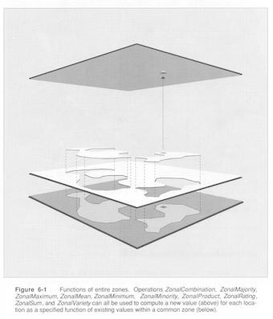

Source : J. Mennis


---
# Opérations zonales ou globales

```{r}
class(r_zoom)
head(values(r_zoom))
# ou r_zoom[]
```

---
# Opérations zonales ou globales

```{r}
table(r_zoom[])*100/ncell(r_zoom[])
```

---
# Opérations zonales ou globales

Aussi avec `cellStats(r, stat=mean)`, `minValues(r)`...

• Statistiques zonales (Z = raster ou vecteur) :

`mon_sf$newcol <- extract(r, mon_sf)`  # pour sf ponctuel

`mon_sf$newcol <- extract(r, mon_sf, fun=mean, df=TRUE)` # pour sf polygones

`mon_sf$newcol <- extract(r, mon_sf, buffer = 100, fun=mean, df=TRUE)`# pour sf ponctuel avec buffer

---

---
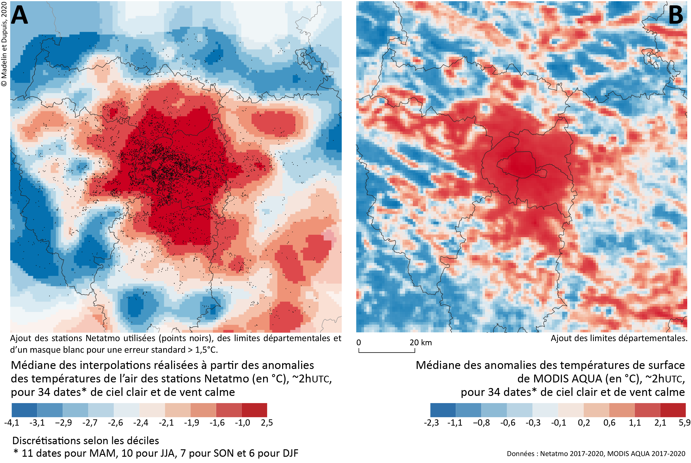
Madelin, Dupuis, 2020

---
# Les traitements des images sat

- amélioration pour aider à l'interprétation

--

- traitements physiques (signal -> propriété physique)

--
- réalisation de zonages 

---
# Les traitements des images sat

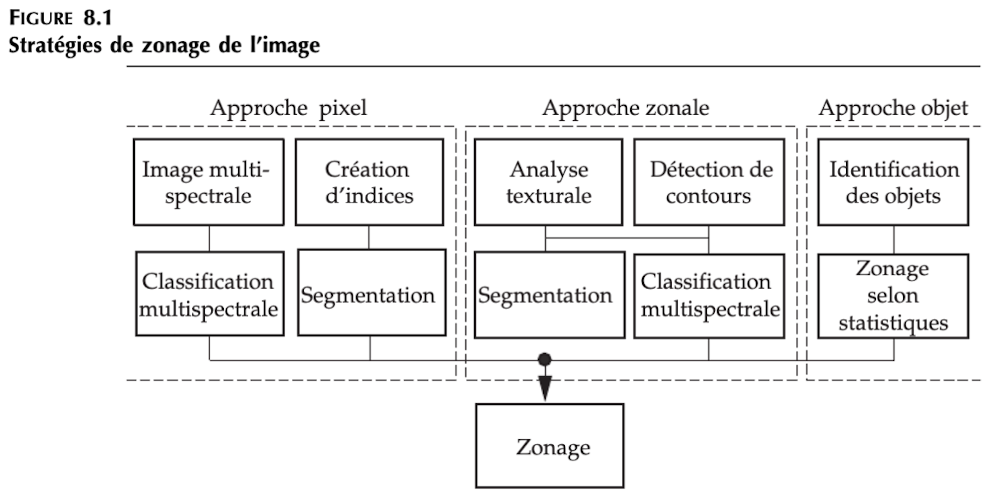
Caloz, Collet, 2001

---
# Les traitements des images sat

Exemple à partir des 4 bandes de Sentinel 10m (B/V/R/PIR)
```{r}
l <- list.files("data/Sentinel/", 
                pattern = "T30TXR_20210528T105621_B",
                full.names=TRUE)
r <- rast(l)
ext <- c(632850.5598, 635636.2748, 5093260.008, 5095436.5536)
r <- crop(r, ext)

```


---
# Cartographie, visualisation

- `{raster}` ou `{raster}`, avec `plot()`
- `{stars}` (qui gère bien les raster lourds, _via_ une agrégation de l'information en amont)
- `{sp}` avec `spplot()`
- `{rasterVis}`, avec `levelplot()`
- `{leaflet}` avec `addRasterImage()`(pb : projection, raster lourds)
- `{tmap}` avec `tm_raster()`
- `{rayshader}` 
- `{mapview}`...


---

# Ressources

Hijmans R. (2019). [Spatial Data Science with R](https://rspatial.org/)

Lovelace R., Nowosad J. & Muenchow J. (2020). [Geocomputation with R](https://geocompr.robinlovelace.net)

Pebesma E. & Bivand R. (2019). [Spatial Data Science with applications in R](https://www.r-spatial.org/book)

Ghosh A. & Hijmans R. [Remote Sensing Image Analysis with R](https://rspatial.org/terra/rs/rs.pdf)


les blogs, Rpubs, RZine, les stackoverflow & Co.

